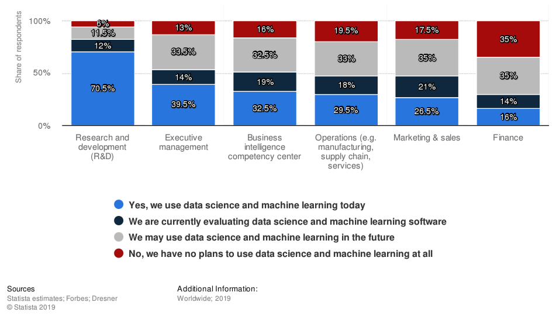

Final Project Proposal

# Algorithmic Trading Using Deep Learning

## ENEL 645 - Winter 2021

University of Calgary

Group 9:

Khaled Behairy

Stan Chen

Burak Gulseren

Lotfi Hasni

Mike Lasby

# Introduction

Machine learning and AI have found a potential use in the finance sector. According to a Statista study, about 65% of the respondents in the finance organizations worldwide are either actively using/evaluating data science and machine learning or open to their adoption in the future (Statista, 2019).

*Fig 1. - Data science and machine learning adoption worldwide 2019, by function, Statista*

Although deeply important to national economies, stock markets are notoriously volatile and difficult to predict (Khan et al., 2020). In order to inform their decision-making, stock traders frequently employ machine learning algorithms to predict future market trends. In fact, it was estimated in 2012 that about 85% of trades within American stock markets were performed by algorithms (Nelson et al., 2017).

Although researchers who support *efficient market hypothesis* claim that it is difficult to accurately predict stock prices, there are systematic proposals showing that accurate modeling and designing of certain variables can lead to models which can very accurately predict future stock prices and stock price movement trends (Mehtab et al., 2020a). Recently, Long-Short-Term-Memory (LSTM) deep learning models have been rising in popularity for predicting future values from time series data (Li et al., 2019; Pinheiro & Dras, 2017). The following document outlines our proposal to predict stock prices with a LSTM deep learning model.

# Data Specification

We propose to use two types of data: time series data and sentiment analysis from text data.

Time series price data: Dataset with data obtained through API calls such as intraday tick data and  Open-High-Low-Close (OHLC) data. Obtained data will be stock specific. It is recorded at regular intervals of time, and the order of these data points is important as features. Consequently, any predictive model based on time series data will have time as an independent variable. The output of the model would be the expected value or classification at a specific time in the future.

Sentiment data: If time permits, we will also consider sentiment data from text related to the stock of interest, for example news articles, forum discussions, and/or financial reports. The sentiment of these documents will be used as features for our model in addition to the time-series stock data.

**Pre-Processing**

Raw data acquired through API calls will contain a set of time series data. The data being used to feed into the system would be selectively transformed before feeding into the pipeline. We will consider and review the effect of min/max normalization on the time series data. We will use a sliding window approach  to train our model.

# Methodology

Since we are predicting future prices from past time-series data, we can consider this as a semi-supervised machine learning pipeline. Our experimental methodology will be as follows:

- Time series stock price data acquisition of selected stocks using FinnHub’s Python API. We will consider the intraday tick data and Open-High-Low-Close (OHLC) data for a variety of  US-based companies.
- Data preparation of time series data into a univariate series by dividing the data into a series of windows with the past tick / OHLC data as the independent variable and the future tick / OHLC data as the responding variable.  
- For each window, we will consider using min/max normalization to normalize the price data within the range of 0 to 1.
- We will define a neural network which will include one or more LSTM layers using the Tensorflow Keras API. These models will be trained on a sliding window of past data and will predict the next window into the future.
- Hyperparameter optimization will be used to find the best performing hyperparameters per stock.
- The best hyper parameters will be selected and be tested on previously unseen data for recent or current stock prices. Metrics regarding the performance of each model will be obtained and compared as described below.
- We will report the results of our experiment including the best performing model and metrics describing the performance of these models.
- Time permitting, we will also consider the sentiment analysis on news articles and/or press releases regarding a given stock. This data will be processed and analyzed using natural language processing techniques and be fed as an additional input to create a multivariate time series input that will then be used to train new models in a similar manner as outlined above.

## Metrics

We will consider a number of metrics typically used to evaluate time series forecast predictions. To evaluate each model, we will use metrics such as  root mean squared error (RMSE), mean percentage error (MPE), and median absolute percentage error (MdAPE). For example, RMSE can be defined as:

Where is the prediction, is the actual value, and N is the number of data points. MdAPE is less sensitive to outliers. It is calculated by taking the middle value of the ordered set of absolute percentage errors. If the number of errors is even, the average of the two middle values is used.

To compare the models with time series tick data only with the models that also include sentiment analysis, we will use mean prediction accuracy (MPA). MPA can be defined as:

For MPA, is the real stock price of the ℓ-th stock on the t-th day, L is the number of stocks, and is the corresponding prediction result (Li et al., 2019). This is the same as one minus the absolute form of the MPE.

Another metric we may consider is directional accuracy. Direction accuracy is a helpful classification-based metric which will be used to quantify the ability to predict direction of price movement (Balaji et al., 2018). The aforementioned metrics that only measure the closeness of a prediction neglect direction(cost functions must always be positive). Mean directional accuracy can be found by simply summing the number of correct rise or fall class predictions by the number of forecasting intervals.

# Project Timeline

See Appendix A for a preliminary project timeline and work breakdown between group members.

# Expected Problems

Time series predictive models may underperform. Training deep learning models requires much more data than most API calls processes generate, with changing market and sentiment influence, pure time series data may not provide enough features for accurate prediction. Instead of using a single super-sophisticated model, we may employ a diversified and adaptive combination of predictive models.

Also, using human expertise around feature engineering, model selection, cost function definition can also provide better context there by improving the performance. Also, if time permits, we will finetune our machine learning pipeline architecture for increased accuracy. Backtesting techniques may also be employed to solve time series related accuracy and performance issues.

**Bibliography**

Balaji, A. J., Ram, D.S. H., & Nair, B. B. (2018). Applicability of Deep Learning Models for Stock Price Forecasting An Empirical Study on BANKEX Data. *Procedia Computer Science*, *143*, 947-953.

Das, S., Behera, R. K., Kumar, M., & Rath, S. K. (2018). Real-Time Sentiment Analysis of Twitter Streaming data for Stock Prediction. *Procedia Computer Science*, *132*, 956-964. https://doi.org/10.1016/j.procs.2018.05.111

Gopalakrishnan, E. A., Menon, V. K., & Kp, S. (2018). NSE Stock Market Prediction Using Deep-Learning Models. *Procedia Computer Science*, *132*, 1351-1362. 10.1016/j.procs.2018.05.050

Khan, W., Ghazanfar, M. a., Azam, M. A., & Karami, A. (2020). Stock market prediction using machine learning classifiers and social media, news. *Journal of Ambient Intelligence and Humanized Computing*, *11*(3).

Li, X., Li, Y., Yang, H., Yang, L., & Liu, X.-Y. (2019). DP-LSTM: Differential Privacy-inspired LSTM for Stock Prediction Using Financial News. *ArXiv*. https://arxiv.org/abs/1912.10806

Lubitz, M. (2017). *Who drives the market ? Sentiment analysis of financial news posted on Reddit and Financial Times*. Faculty of Engineering, University of Freiburg. https://ad-publications.cs.uni-freiburg.de/theses/Bachelor_Michael_Lubitz_2018.pdf

Mehtab, S., & Sen, J. (2020b). *Stock Price Prediction Using Convolutional Neural Networks on a Multivariate Timeseries*. ArXiv. https://arxiv.org/abs/2001.09769

Mehtab, S., Sen, J., & Dutta, A. (2020a). Stock Price Prediction Using Machine Learning and LSTM-Based Deep Learning Models. *Second International Symposium on Machine Learning and Metaheuristics Algorithms*.

Melinte, D. O., Travediu, A.-M., & Dumitriu, D. N. (2020). Deep Convolutional Neural Networks Object Detector for Real-Time Waste Identification. *Applied Sciences*, *10*(20), 7301. 10.3390

Mittal, A., & Goel, A. (2011). *Stock Prediction Using Twitter Sentiment Analysis*. Stanford CS229. http://cs229.stanford.edu/proj2011/GoelMittal-StockMarketPredictionUsingTwitterSentimentAnalysis.pdf

Nelson, D. M.Q., de Oliveira, R. A., & Pereira, A. C.M. (2017). Stock market's price movement prediction with LSTM neural networks. *2017 International Joint Conference on Neural Networks (IJCNN)*, *Anchorage, AK*, 1419-1426. 10.1109/IJCNN.2017.7966019

Pinheiro, L. d. S., & Dras, M. (2017). Stock Market Prediction with Deep Learning: A Character-based Neural Language Model for Event-based Trading. *Proceedings of the Australasian Language Technology Association Workshop 2017*, 6-15. https://www.aclweb.org/anthology/U17-1001

Statista. (2019, September 30). *Deployment status of data science and machine learning in organizations worldwide as of 2019, by function*. Statista Estimates. Retrieved 2 15, 2021, from http://www.statista.com/statistics/1053561/data-science-machine-learning-deployment-by-function/

Strader, T. J., Rozycki, J. J., Root, T. H., & Huang, Y.-H. (. (2017). Machine Learning Stock Market Prediction Studies: Review and Research Directions. *Journal of International Technology and Information Management*, *28*(4), 63-83.

# **Team Work Distribution:**

| **Team Member** | **Grade Adjustment**       | **Work Completed**                                           |
| --------------- | -------------------------- | ------------------------------------------------------------ |
| Khaled Behairy  | **3 - No Grade Reduction** | Research, Methodology, project timeline                      |
| Stan Chen       | **3 - No Grade Reduction** | Data specification, Research, Expected Problems Section, project timeline |
| Burak Gulseren  | **3 - No Grade Reduction** | Research, Introduction section, project timeline, project timeline |
| Lotfi Hasni     | **3 - No Grade Reduction** | Research and Metrics Section, References, project timeline   |
| Mike Lasby      | **3 - No Grade Reduction** | Research, Document Skeleton, Part of research summary, experimental methodology, project timeline |

# **Appendix A: Project Timeline**

ENEL-645

Final Project Proposal                             